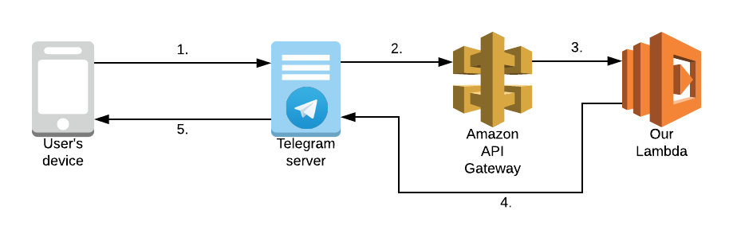
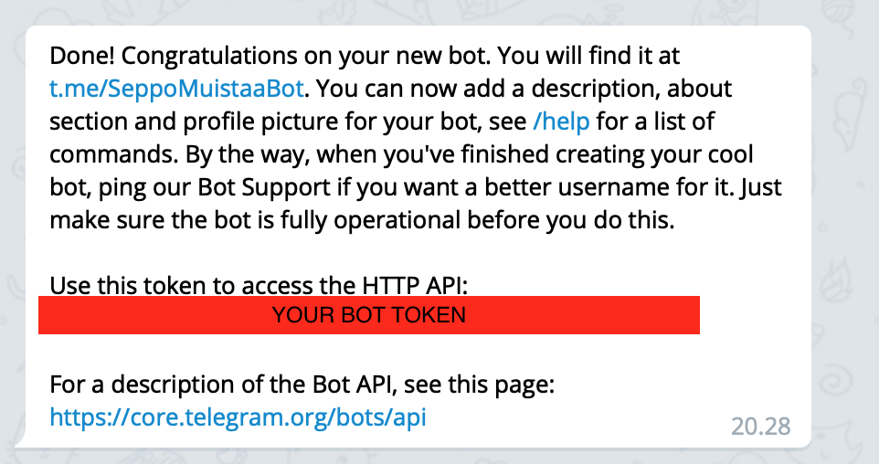

# Serverless Chatbot: Part One

In this part we will create a working Telegram chatbot and deploy it to the AWS. The chatbot will be very simple at
this stage but hey everyone needs to start somewhere!

## Prerequisites

Before starting make sure you have the following:

* Basic skills with command line (very simple stuff like how to navigate between directories and how to execute commands)
* A text editor or IDE of your choice (we are going to write a bit of Javascript)
* [curl]() (you can check if you have curl by running `curl --version`) or any other HTTP client (eg. Postman, etc.)
* [NodeJS](https://nodejs.org) (you also need the package manager **npm** which should come with node)
* **AWS access keys** (this includes the access key id and the secret access key)
* A [Telegram](https://telegram.org/) account and a client (it is recommended that you have the client on the same computer you are using right now)


## Goal of part one

Our goal here is to get started with the chatbot development by creating a simple chatbot and deploying it to AWS.

## Instructions

### 1. Installing Serverless Framework

For building and deploying our chatbot we will be using the [Serverless Framework](https://serverless.com/). You can download serverless framework by running:

```bash
npm install serverless -g
```

Then we need to choose a name for our bot and create a serverless project by running:

```bash
serverless create --template aws-nodejs --path my-chatbot --name <Name of your bot>
```

This will create an empty serverless project based on the aws-nodejs template. The project will be placed in directory
called "my-chatbot". You can change the name of the folder to whatever you like.

In the directory we will see two new files:

* `serverless.yml` - This is the configuration file for the serverless framework application. It contains the definition of one or multiple
    AWS lambda functions as well as any other resources our application might need. At this point we can see that there is already one lambda function
    defined called "hello" with its "handler" set to `handler.hello`. This means that the lambda function will start its execution from the function
    called `hello` in the file `handler.js`.
* `handler.js` - This contains source code of our first Lambda function. We will be modifying this soon.

### 2. Deploying the Lambda function

In order to deploy the Lambda function we need to make sure that the serverless can see our AWS access keys. Easiest way
to do this is to set the environmental variables `AWS_ACCESS_KEY_ID` and `AWS_SECRET_ACCESS_KEY`. You can do that by running
these commands in your terminal:

```bash
export AWS_ACCESS_KEY_ID=<Access key ID>
export AWS_SECRET_ACCESS_KEY=<Secret access key>
```

*Be careful not to share these credentials as bad people can do bad things with them. Many people accidentally share these
credentials by commiting them to a public version control like GitHub, so be careful.*

After we have set up the credentials we can deploy our lambda with:

```bash
serverless deploy
```

This will take a moment. After this process is done we can test our new lambda function by running:

```bash
serverless invoke -f hello
```

Yay. Now our code is running in the cloud!

### 3. Listening to events

So far our function only runs when we explicitly invoke it with the serverless command. In order for it to be usefull we
need to add an event listener which will execute our function whenever an event occurs. There are plenty of different events
to choose from (HTTP request to the API Gateway, file creation in S3, row change in DynamoDB, Kinesis data streams, etc.) but
for now we'll stick to listening HTTP requests.

Open up `serverless.yml` and you should see the following function definition:

```yaml
functions:                  # This starts the functions section which defines all lambda functions in our application
  hello:                    # This line defines a function named "hello"
    handler: handler.hello  # This sets the function hello in file handler.js as the entrypoint of the lambda function
```

**NOTE:** `serverless.yml` is a YAML file where the indentation of lines has syntaxical meaning. Also in YAML files the
indentation should be made using spaces instead of tab characters.

We will need to extend this function definition to include an event listener for HTTP requests. This will create an Amazon
API Gateway for us which routes messages sent to the endpoints we specify to our lambda function. Here's the section after the change:

```yaml
functions:
  hello:
    handler: handler.hello
    events:                 # This starts the list of event listeners. A single lambda can listen to multiple different event sources
      - http:               # http event type means a HTTP request to the amazon API Gateway
          path: execute     # This correspond to URL path /execute
          method: get       # The lambda will listen for GET requests (other possible values: post, put, delete, etc.)
```

Now with this change in place we can re-deploy the function by running again:

```bash
serverless deploy
```

After deploy you will see the newly created endpoint printed out in your terminal. It will look something like
`GET - https://u3ir5tjcsf.execute-api.us-east-1.amazonaws.com/dev/execute`. You can open the URL in a browser and Voilà!
our lambda function is now invokable by HTTP requests.

### 4. Making a chatbot

Now that we have a lambda that can respond to HTTP requests we have everything that we need to make a simple chatbot.
Telegram bots work on the simple logic that when a user sends a message to a chatbot that message first goes to the
Telegram servers. Their server then passes that message on to a HTTP endpoint that we can define and then our bot can
respond to the user's message by calling the Telegram's API.


*(1) The user writes a message to the bot's chat which gets passed to the telegram servers. (2) The telegram server calls the HTTP endpoint we have defined
(3) The API Gateway creates an event which triggers our lambda function. (4) Our lambda function responds to the user's message by calling the telegram API.
(5) The telegram server sends our response to the user.*

The first step in creating a chatbot will be registering our bot with Telegram in order to get access to the Telegram API.
Telegram has a special bot called the "BotFather" who handles registration and configuration of other Telegram bots.

Let's shoot [@BotFather](https://t.me/BotFather) a message on Telegram. Send BotFather the `/newbot` command which
initiates the new bot creation flow. First he will ask for the name of your bot. You can freely choose a name and it can
include special characters like spaces. Next you need to provide your bots *username*. This is the unique identifier of
your bot. There are some limitations for example it needs to end in "bot" and cannot contain spaces. Also the username
needs to be globally unique so you might need to try couple times. Finally you will see a message like this:



Let's add the bot token as an evironment variable so our code can use it. Copy the token from BotFather's response and
add it to your environment:

```bash
export TELEGRAM_TOKEN=<Bot API Token>
```

Now let's turn our focus to the code of our bot. We need to change the code of our lambda function in `handler.js`, but
first we need one library. We are going to use the `telegram-bot-api` package for interacting with the Telegram API. Install it with:

```bash
npm install telegram-bot-api
```

Now we can change the code in `handler.js`. First let's instantiate the telegram api client at the start of the file,
just under the line `'use strict';`

```node
// Create the telegram api client
const Telegram = require('telegram-bot-api');
const api = new Telegram({
  token: process.env.TELEGRAM_TOKEN
});
```

With this client we can easily interact with the Telegram API. The client uses the telegram bot token that we added to our
environment for identification. Now let's make our bot give us a proper greeting. Replace the `hello` function with:

```node
module.exports.hello = async (event, context) => {
  try {
    // Read data from the incoming message
    const data = JSON.parse(event.body);
    const chatId = data.message.chat.id;
    const message = data.message.text;
    const firstName = data.message.chat.first_name;

    // The first message sent to a Telegram bot is always "/start"
    if(message === "/start") {
      await api.sendMessage({
        chat_id: chatId,
        text: `Nice to meet you, ${firstName}!`
      });
    }
    // Let's respond with a different response for other messages
    else {
      await api.sendMessage({
        chat_id: chatId,
        text: `Very interesting, ${firstName}`
      });
    }

  } catch (e) {
    // Something went wrong. Let's write it to the log
    console.error(e);
  }

  // For telegram bots it is good to always respond with success code 200 as otherwise the Telegram server will resend the message to our bot
  return { statusCode: 200 };
};
```

With this our handler.js should look like this:

```node
'use strict';
// Create the telegram api client
const Telegram = require('telegram-bot-api');
const api = new Telegram({
  token: process.env.TELEGRAM_TOKEN
});

module.exports.hello = async (event, context) => {
  try {
    // Read data from the incoming message
    const data = JSON.parse(event.body);
    const chatId = data.message.chat.id;
    const message = data.message.text;
    const firstName = data.message.chat.first_name;

    // The first message sent to a Telegram bot is always "/start"
    if (message === "/start") {
      await api.sendMessage({
        chat_id: chatId,
        text: `Nice to meet you, ${firstName}!`
      });
    }
    // Let's respond with a different response for other messages
    else {
      await api.sendMessage({
        chat_id: chatId,
        text: `Very interesting, ${firstName}`
      });
    }

  } catch (e) {
    // Something went wrong. Let's write it to the log
    console.error(e);
  }

  // For telegram bots it is good to always respond with success code 200 as otherwise the Telegram server will resend the message to our bot
  return {statusCode: 200};
};
```

Our bot is almost complete but we also need to make a slight change in the `serverless.yml` file. Because Telegram servers
will be sending data to our bot we need to change the endpoint to accept HTTP POST requests. Also we need to enable something
called CORS to allow a third-party (Telegram in this case) to call our endpoint. We also need to specify in the `provider` section
that we want the `TELEGRAM_TOKEN` environmental variable to be passed to our lambda function. Here are the changes we need to do:

```yaml
provider:
  name: aws
  runtime: nodejs8.10
  environment:
      TELEGRAM_TOKEN: ${env:TELEGRAM_TOKEN} # This adds the TELEGRAM_TOKEN variable in our local environment to the lambda function

functions:
  hello:
    handler: handler.hello
    events:
      - http:
          path: execute
          method: post  # Change the method to post
          cors: true    # This allows Telegram to call our endpoint
```

Now let's deploy our code again.

```bash
serverless deploy
```

With this our bot should be ready but the only problem is that the Telegram is not sending the messages to our bot as
we haven't registered our bot endpoint with Telegram. Sadly this is something the BotFather cannot help us with. Instead
we need to call the bot API directly. Luckily we only need to do this once. We will need our lambda's endpoint URL. It should
be visible in your terminal as serverless displays it after each deploy. Let's send our URL to Telegram with curl (remember
to replace the URL with our lambda's URL):

```bash
curl --request POST \
--url https://api.telegram.org/bot$TELEGRAM_TOKEN/setWebhook \
--header 'content-type: application/json' \
--data '{"url": "<Your bot url>"}'
```

Congratulations! You just created your first Telegram bot. Send your bot a message and see it respond.

## Summary

We created a simple but functioning Telegram bot from nothing with hardly any effort. However, so far our bot doesn't
do anything expect says pleasantries. There is also much more to the world of serverless than Lambda functions responding to
HTTP requests. In the next step we will integrate our bot will DynamoDB to allow it to remember things from one invokation
to the next.


